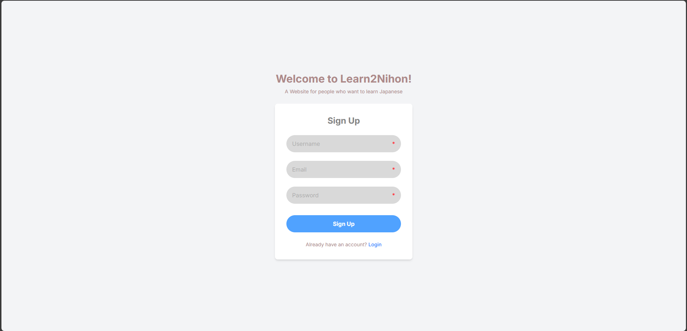

# 📘 Learn2Nihon - Features, Challenges, and Future Directions

This document provides a comprehensive overview of the features implemented in **Learn2Nihon**, the technical challenges encountered during development, the solutions applied, and the future roadmap for the project.

---

## ✨ 1. Main Features

### 1.1. User Authentication System
A secure and robust authentication flow is the foundation of Learn2Nihon, managing user access to learning content.

- **User Registration with Email Verification:**  
  New users can create an account using a username, email, and password. After registration, a verification email is automatically sent. Users must click a link in the email to activate their account before logging in. The backend ensures username uniqueness and email validity.

  

  *Signup Page*  

  
  *Check Email Page*

- **Login:**  
  The system supports logging in with a username and password. Login is only successful for verified accounts.

- **JWT-Powered Sessions (localStorage):**  
  User sessions are managed using JSON Web Tokens (JWT). Upon successful login, the client receives an `access_token` (short-lived) and a `refresh_token` (long-lived), which are stored in the client's localStorage.

- **Client-Side Token Handling:**  
  An axios request interceptor automatically attaches the `access_token` to the `Authorization` header of outgoing API requests for protected routes.

- **Secure Logout:**  
  The logout process clears all authentication data from the client's localStorage.

- **Global Auth State:**  
  A central `AuthContext` provides authentication status (`user`, `isLoggedIn`, `loading`) to all Client Components, allowing the UI (like the Header) to dynamically adapt based on the user's login state. Information for the user is decoded from the JWT payload.

  *Login page*

---

### 1.2. Vocabulary Practice Module 

A structured module for learning and reviewing Japanese vocabulary based on the 50 lessons of *Minna no Nihongo*.

#### Lesson Selection
Users can browse and select any of the 50 *Minna no Nihongo* lessons from a dedicated page.

*Vocabulary Lesson Selection Page*

#### Interactive Vocabulary Flashcards
Upon selecting a lesson, users are presented with an interactive flashcard system for the vocabulary words of that lesson.  

- **Front Side**: Displays the Japanese word (Kanji/Kana) and its Hiragana reading.  
- **Back Side**: Reveals the word's Vietnamese meaning, part of speech, and example sentences.  
- **Navigation**: Users can move through vocabulary cards using "Next" and "Previous" buttons or keyboard arrow keys.  
- **Flip Functionality**: Clicking on a card or pressing the spacebar flips the card to reveal the other side.  

#### Dynamic Content
Vocabulary data for each lesson is fetched from the backend API.

*Vocabulary Flashcard (Front)*

*Vocabulary Flashcard (Back)*

---

### 1.3. Kanji Practice Module
An interactive module to help users learn and practice Japanese Kanji.

- **Level Selection:**  
  Users can choose their desired JLPT Kanji level (N5, N4, N3, N2, N1) from a dedicated page.

    
  *Kanji Level Selection Page*

- **Interactive Flashcards:**  
  For a selected level, the system displays Kanji in an interactive flashcard format.
  - **Front Side:** Shows the Kanji character, Kun'yomi readings, On'yomi readings, and stroke count.  
  - **Back Side:** Reveals the Kanji's meaning and provides detailed explanations.  
  - **Navigation:** Users can move through Kanji cards using "Next" and "Previous" buttons or keyboard arrow keys.  
  - **Flip Functionality:** Clicking on a card or pressing the spacebar flips the card to reveal the other side.  

- **Dynamic Content:**  
  Kanji data for each level is retrieved from the backend API. Each study session provides users with a random set of 20 words selected from their chosen level.

    
  *Kanji Practice Flashcard (Front)*

    
  *Kanji Practice Flashcard (Back)*

---

### 1.4. Reading Comprehension Module
A module for practicing Japanese reading skills with interactive questions.

  
  *Reading Practice Selection Page*

- **Dynamic Content:**  
  Reading passages and associated multiple-choice questions are fetched from the backend API.

- **Single Choice Answers:**  
  Users can select one answer for each question.

- **Submission & Grading:**  
  - After answering all questions, users can submit their responses.  
  - The system displays whether each selected answer was correct or incorrect.  
  - The correct answer is highlighted, and an explanation is provided for each question after submission.

- **Completion Workflow:**  
  After submitting and reviewing, a **“Complete”** button allows users to return to the main application.

    
    
  *Reading Practice Page*

---

### 1.5. AI Chatbot (In Development)
An interactive chatbot designed to help users practice Japanese conversation or seek assistance.

- **Text Input:** Users can type messages to communicate with the AI.  
- **Voice-to-Text Integration:** Utilizes Azure Speech-to-Text for seamless voice input, allowing users to speak their messages directly.  
- **Real-time Conversation:** AI responses are displayed dynamically, mimicking a live chat experience.  
- **Scrollable Chat History:** The chat area is designed to show messages chronologically, with automatic scrolling to the latest message.  
- **Fixed Input Area:** The message input box remains fixed at the bottom of the screen, ensuring accessibility during long conversations.  

---

## 💡 2. Advanced Features Implemented

- **Dynamic Theming/Layout:**  
  A `LayoutContext` manages global UI states, such as Sidebar expansion/collapse, allowing Header and main content areas to adapt dynamically.

- **Voice-to-Text Integration:**  
  Uses Azure Speech-to-Text for a natural input method in the Kaiwa chatbot.

- **AI-Powered Chatbot for Conversation Practice:**  
  Provides users with an interactive method to practice real-life communication, simulating natural dialogues to enhance speaking and listening skills.

---

## 🎯 3. Challenges Faced & Solutions

During the development of Learn2Nihon, the team, comprising members with varying levels of experience in modern web development, encountered several significant challenges. These ranged from foundational setup to complex UI/UX and deployment issues.

### Challenge: Steep Learning Curve with Next.js 13+ App Router
- **Problem:**  
  Transitioning from traditional React to Next.js 13+'s App Router (with Server Components, Client Components, Data Fetching paradigms) presented a significant learning curve. Understanding when and where to use `use client`, how data flows between server/client, and how to properly manage shared state (Context API) across this boundary was initially confusing.  

- **Solution:**  
  Extensive research into Next.js documentation, online tutorials, and iterative experimentation. Implementing clear separation of concerns (e.g., dedicated API services, custom hooks) helped manage complexity. Debugging focused on understanding the rendering lifecycle of each component.

### Challenge: Mastering FastAPI Backend Development & ORM Integration
- **Problem:**  
  For members new to Python backend development, understanding FastAPI's asynchronous nature, Pydantic models, dependency injection, and integrating with SQLAlchemy (ORM) for PostgreSQL database interactions was complex. Setting up proper CRUD operations and authentication logic required careful attention.  

- **Solution:**  
  Leveraged FastAPI's excellent documentation and community resources. Prioritized unit testing for API endpoints and ORM functions to ensure correctness. Adopted a modular structure for FastAPI (routers, schemas, crud files) to keep the codebase organized.

---

## 🚦 4. Known Limitations

- The application currently does not provide a function to **reset password** (Forgot Password). Will be added in the future.  
- **No Token Refresh Logic:** The frontend currently lacks implementation for automatically refreshing `access_tokens` using `refresh_tokens`, potentially leading to session interruptions when `access_token` expires.  
- Grammar learning functionality is not yet implemented.  
- User profile management is not available.  
- Personalized learning features are missing (e.g., tracking study progress, saving unknown vocabulary lists, generating personalized learning paths, sending reminders after long periods of inactivity).  
- Listening practice and mock test modules are still under development.  

---

## 🌟 5. Future Directions

- **Enhanced Authentication:**  
  Implement token refresh logic, password reset functionality, and potentially migrate to HttpOnly cookies for stronger security and seamless SSR.  

- **Social Learning Features:**  
  Allow users to add friends and create groups for discussion and collaborative learning.  

- **Personalized Learning Paths:**  
  Provide personalized learning paths for each user, based on the initial test (taken when the user first completes the mock exam on the platform).  

- **Gamification:**  
  Implement a points system, leaderboards, and achievements to enhance user engagement.  

- **Multi-language Support:**  
  Expand UI and content to support multiple languages.  
